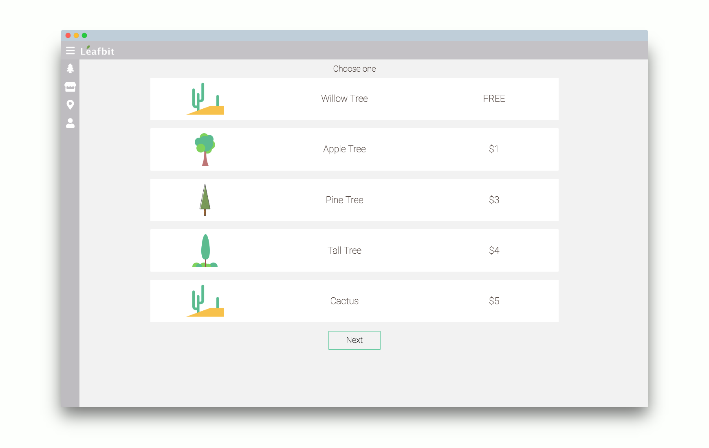
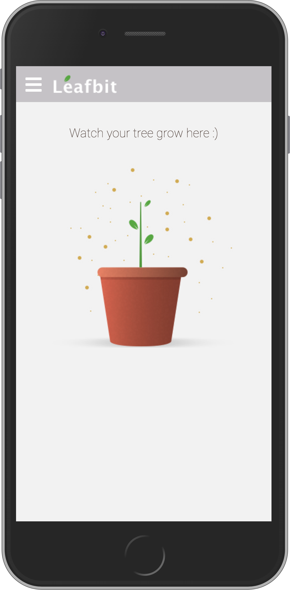
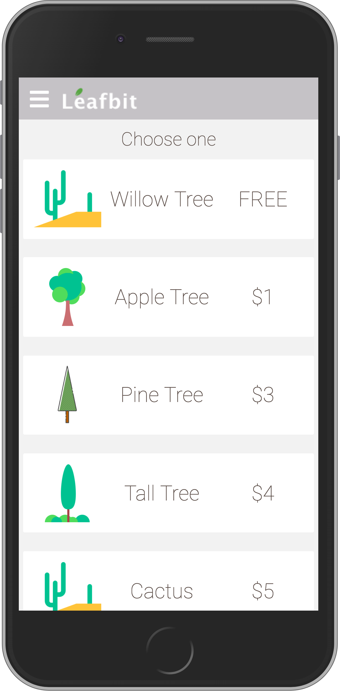
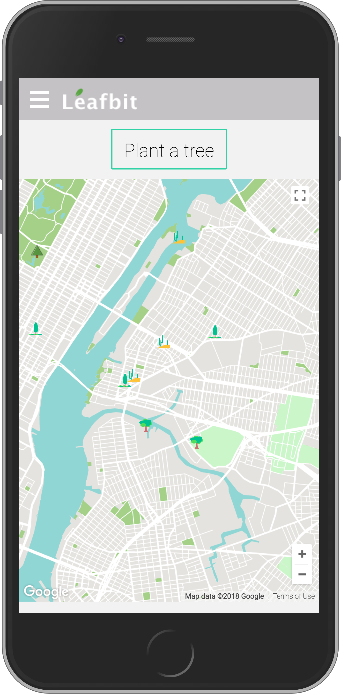

# Leafbit :seedling:

Buy a seed. Watch your tree grow as you progress towards your activity goals. Plant your tree on the map when the tree reaches its maturity :deciduous_tree:. 

Feel good about partner organizations planting a tree in real life. 

This Fitbit clock face works together with [Leafbit Web App](https://github.com/husheric/LeafbitWeb).

## Features 

**Home**

See the current progress of your tree (paired with Fitbit)

 

**Marketplace**

Buy your seeds and set goals for seeds

**Plant** 

Once your tree reaches its maturity, plant a tree on the map 

## Fitbit Challenge

Empower and inspire users to live a healthier, more active life. 

## Contributors 

[David](https://github.com/davidyshin) - Developer 

[Eric](https://github.com/husheric) - Developer 

[Yueran]() - UI/UX Designer

[Helen](https://github.com/helencho) - Developer

## Technologies

[Fitbit OS SDK](https://dev.fitbit.com/)